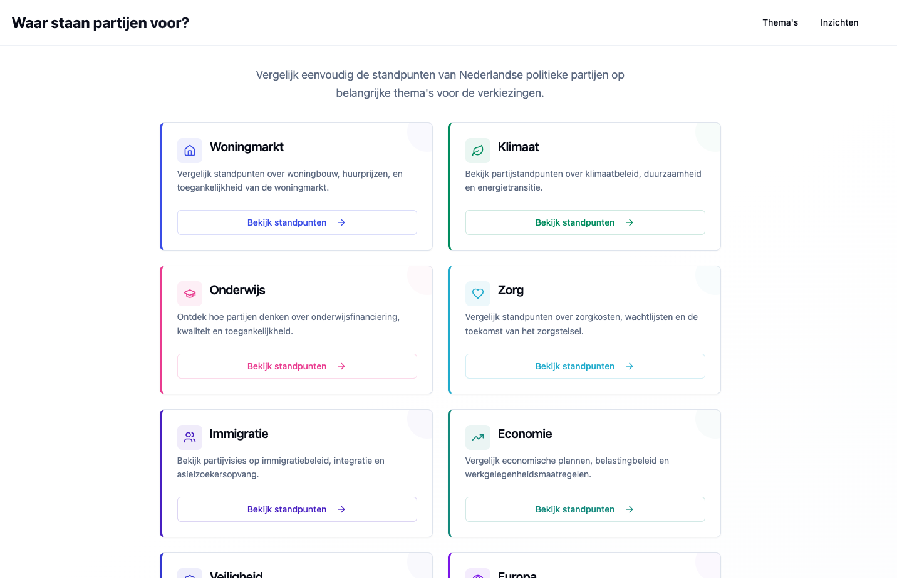
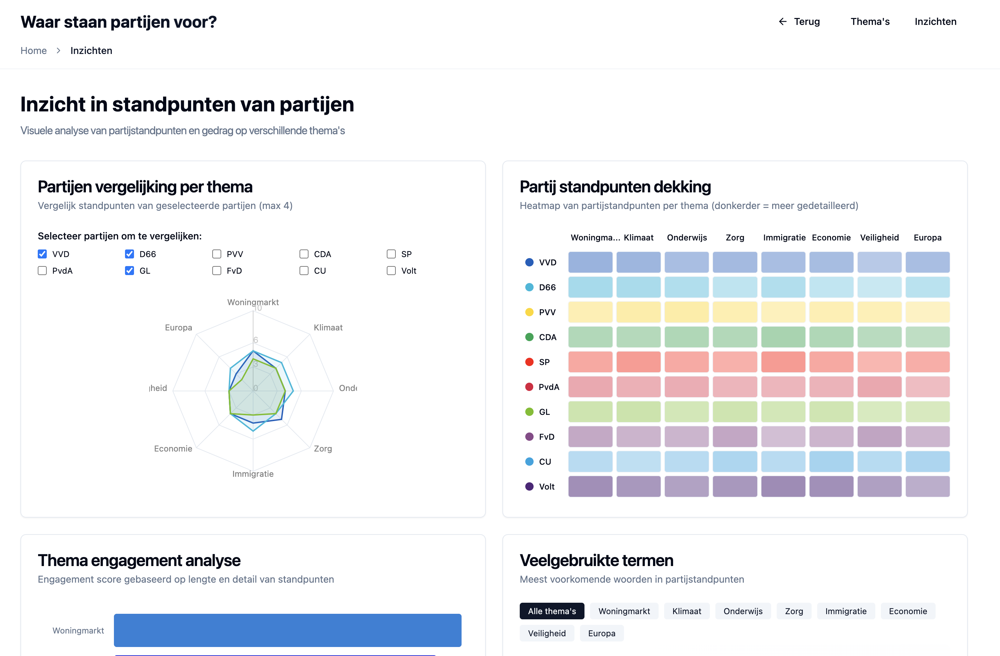

# Project Overview

This demo project showcases a modern, production-ready frontend that I built in under an hour, using a vibe coding workflow using [Lovable](https://lovable.dev/) and the [Cursor IDE](https://www.cursor.com/).

Not only did I built this prototype in under an hour - I also implemented automated deployment in minutes using [Netlfiy](https://www.netlify.com/).

I built it with React, TypeScript, shadcn/ui, and ViteJS, with a focus on rapid prototyping, clean architecture, and automated deployment.

## Prototype Disclaimer

> This project is a very early prototype and is not intended for real-world use. While it demonstrates working frontend functionality, it does not include a backend, production database, authentication, or other complex features required for a production application.
>
> However, it serves as proof of my ability to leverage modern tools to quickly develop a usable frontend prototype. This approach enables rapid iteration and can significantly accelerate the early stages of developing a new app.

## Screenshots

Below are some screenshots demonstrating the main features and pages of this prototype:

**Homepage**



---

**Insights Page**



---


---

**Party Comparison**


---

**Admin Page (View 1)**


---

**Admin Page (View 2)**


---

**Admin Page (View 3)**


## Tech Stack & Tools

- **React**: Component-driven UI development for scalable, maintainable interfaces.
- **TypeScript**: Type-safe codebase with advanced type patterns, ensuring reliability and maintainability.
- **ViteJS**: Lightning-fast build tool and dev server for instant feedback and efficient development.
- **shadcn/ui**: Modern, accessible UI components for rapid, high-quality interface design.
- **Tailwind CSS**: Utility-first CSS framework for consistent, responsive styling.
- **Lovable**: Automated deployment and instant preview, enabling continuous delivery from the first commit.
- **Cursor IDE**: Efficient, "vibe" coding experience with AI-powered assistance and modern developer ergonomics.
- **Netlify**: Deploy any modern frontend stack in minutes.

## Development Approach

- **Rapid Prototyping**: Built the entire demo—including UI, logic, and deployment—in under an hour.
- **TypeScript Best Practices**: Utilized advanced types, discriminated unions, and type inference for robust, self-documenting code.
- **Component Modularity**: Structured with reusable, composable React components and hooks.
- **UI/UX Quality**: Leveraged shadcn/ui and Tailwind CSS for accessible, visually appealing interfaces.
- **Automated Deployment**: Integrated Netlify for seamless, zero-config deployment and instant sharing.
- **Modern Workflow**: Used Cursor IDE for fast iteration, code intelligence, and a smooth developer experience.

## What This Demonstrates

- Ability to deliver high-quality, modern frontend solutions rapidly.
- Deep familiarity with the latest React, TypeScript, and UI frameworks.
- Commitment to code quality, scalability, and maintainability.
- Experience with automated deployment and modern developer tooling.

## Live Preview & Deployment

This project is instantly previewable via Netlify, you can find it [here](https://demodashboardvotinginfo.netlify.app/).

Check out the:

- [Home page](https://demodashboardvotinginfo.netlify.app/)
- [Insights page](https://demodashboardvotinginfo.netlify.app/insights)
- [Admin page](https://demodashboardvotinginfo.netlify.app/admin)

## Getting Started (for Developers)

Interested in running this project locally? Follow these steps:

### Prerequisites

- [Node.js](https://nodejs.org/) (v16+ recommended)
- [npm](https://www.npmjs.com/) (comes with Node.js)

### Installation & Local Development

```sh
# 1. Clone the repository
git clone https://github.com/raoulcapello/demo-dashboard-react-typescript.git
cd demo-dashboard-react-typescript

# 2. Install dependencies
npm install

# 3. Start the local development server
npm run dev
```

The project uses Vite for instant hot-reloading and fast feedback during development. You can now access the app at [http://localhost:8080/](http://localhost:8080/) (or the port shown in your terminal).

For any questions or contributions, feel free to open an issue or pull request, or contact me via [LinkedIn](https://www.linkedin.com/in/raoulcapello/) or [email](mailto:raoul@raoulcapello.nl)! 🙂
